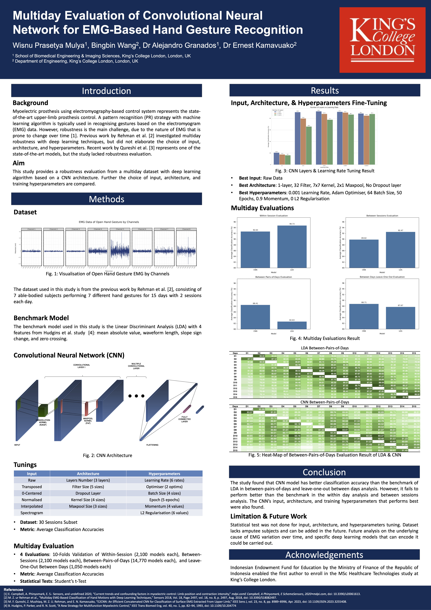

# Multiday Evaluation of Convolutional Neural Network for EMG-Based Hand Gesture Recognition

This project is submitted in partial fulfilment of the Master of Science degree in Healthcare Technologies at King's College London.

Rights to reuse must be verbally given by the maintainer of this repo.

